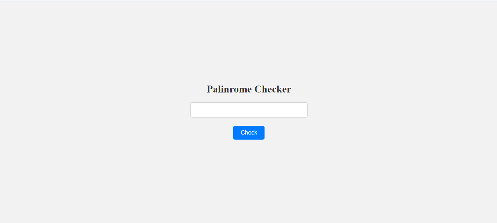

# Palindrome-Checker
Palindrome Checker Project  This repository houses my implementation of the Palindrome Checker project from FreeCodeCamp. It's built using HTML, CSS, and JavaScript, serving as a refresher for my JavaScript skills. The project allows users to input a string and determine if it's a palindrome. Feel free to explore and provide feedback!

